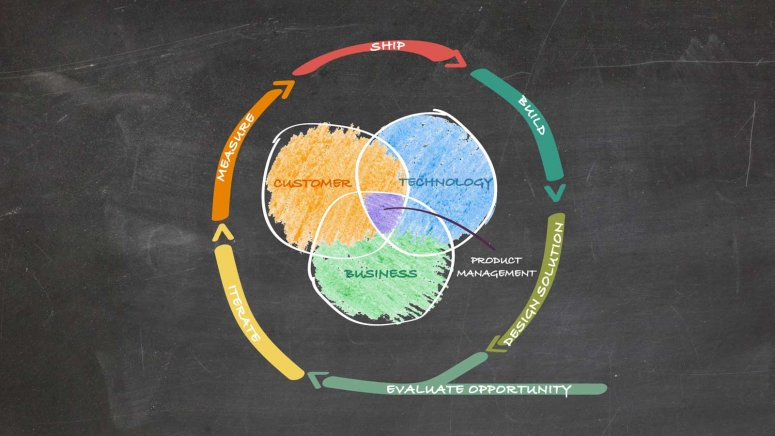

# Stanford Product Management

XPRODMGT110

---

---

Transforming Opportunities into Great Products

- [Stanford Product Management](#stanford-product-management)
  - [Product Manager Principles](#product-manager-principles)
  - [Product Lifecycle](#product-lifecycle)
  - [Problem Space vs Solution Space](#problem-space-vs-solution-space)
  - [Opportunity Statement](#opportunity-statement)

---

## Product Manager Principles

1. You're both the CEO and the Janitor
1. Eyes on the big picture and on the bugs (being able to zoom up and down the stack)
1. Intra and inter team communication (being the glue of your team and the router of other teams)
1. Influencing without authority (PM don't have direct authority)
1. Know your users
1. Bring the doughnuts

## Product Lifecycle

Product Lifecycle is a generic framework for solving problems.

1. Evaluate Opportunity
2. Design Solution
3. Build
4. Ship
5. Measure

## Problem Space vs Solution Space

_"If I had asked people what they wanted, they would have said faster horses"_ - Henry Ford

Clearly identify the line between _Problem Space_ and _Solution Space._

One of core roles as PM is to hear what customers are asking in the Problem Space and interpret that in the Solution Space.

Problem space has no solutions allowed. How things work today and understand reality.

Solution Space requires clear problem statement and focuses on how to focus the problem.

## Opportunity Statement

The framing of the opportunity statement starts with __"How might we..."__

- _"How"_ Assumes there is a solution

- _"Might"_ It's ok if not the right solution

- _"We"_ Something the team can achieve together